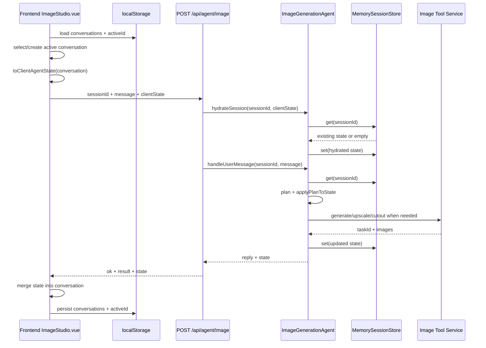

# Session 管理梳理

本文梳理当前工程中图片生成 Agent 的 session 管理方式。这里的 session 不是登录态，也不依赖 cookie、JWT 或服务端认证；它指一条图片生成对话及其多轮图片上下文。

## 总览

当前 session 由前后端共同维护：

- 前端负责创建会话、切换会话、保存历史消息、保存图片结果，并通过 `localStorage` 持久化。
- 后端负责在每次 Agent 请求中恢复图片上下文、规划下一步动作、更新会话状态，并通过内存 `Map` 暂存。
- 每次请求都由前端显式传入 `sessionId` 和 `clientState`，后端先 hydrate，再处理本轮消息。

核心文件：

- 前端会话入口：`frontend/src/components/ImageStudio.vue`
- 后端路由入口：`backend/src/routes/agent-image.ts`
- 后端 Agent：`backend/src/agent/image-generation-agent.ts`
- 后端会话存储：`backend/src/agent/session-store.ts`
- 会话类型定义：`backend/src/agent/types.ts`

## Session 标识

前端创建新对话时会生成一个会话 id：

```ts
function createId(prefix = "id") {
  return `${prefix}_${Date.now()}_${Math.random().toString(16).slice(2)}`
}
```

新会话使用 `createId("session")` 生成 id。这个 id 同时作为：

- 前端 `StoredConversation.id`
- 前端 `ClientAgentState.sessionId`
- 请求体里的 `sessionId`
- 后端 `MemorySessionStore` 的 key
- 后端 `ImageSessionState.sessionId`

因此当前系统没有额外的服务端 session 创建接口，session 是由前端生成并在请求中带给后端的。

## 前端 Session 数据结构

前端主要维护两层数据。

### StoredConversation

`StoredConversation` 是 UI 层的完整对话记录，包含标题、消息、图片和 Agent 状态：

```ts
type StoredConversation = {
  id: string
  title: string
  updatedAt: number
  createdAt: number
  messages: ChatMessage[]
  images: string[]
  primaryImage: string | null
  taskId?: string
  lastPrompt: string
  agentState?: ClientAgentState
}
```

它主要服务于：

- 左侧会话列表
- 当前对话消息流
- 当前图片预览
- 页面刷新后的恢复

### ClientAgentState

`ClientAgentState` 是传给后端的图片 Agent 上下文：

```ts
type ClientAgentState = {
  sessionId: string
  currentPrompt?: string
  currentUserPrompt?: string
  canonicalPrompt?: string
  lastSuccessfulPrompt?: string
  subject?: string
  style?: string
  scene?: string
  composition?: string
  lighting?: string
  colorPalette?: string
  width: number
  height: number
  numImage: number
  lastTaskId?: string
  lastImages: string[]
  primaryImage?: string
}
```

它不包含完整聊天历史，重点是让后端知道上一轮图片生成的 prompt、结构化视觉要素、尺寸、张数和上一批图片。

## 前端持久化

前端使用两个 `localStorage` key：

```ts
const STORAGE_KEY = "image-agent-conversations-v1"
const ACTIVE_ID_STORAGE_KEY = "image-agent-active-conversation-id-v1"
```

保存内容：

- `STORAGE_KEY`：所有 `StoredConversation[]`
- `ACTIVE_ID_STORAGE_KEY`：当前激活会话 id

加载流程：

1. `onMounted()` 调用 `loadConversations()` 读取历史会话。
2. 调用 `loadActiveConversationId()` 读取上次激活的会话 id。
3. 如果本地有历史会话，优先恢复上次激活会话；否则默认选择第一条。
4. 如果本地没有历史会话，创建一个新的空会话并立即保存。

保存流程：

- `watch(conversations, { deep: true })`：会话数组发生变化时写回 `localStorage`。
- `watch(activeId)`：当前会话变化时保存激活会话 id。

## 前端会话生命周期

### 创建会话

`handleNewChat()` 会调用 `createEmptyConversation()`：

- 生成新的 `session_xxx` id。
- 初始化欢迎消息。
- 初始化空图片列表。
- 初始化 `agentState`，默认 `width=1024`、`height=1024`、`numImage=2`、`lastImages=[]`。
- 设置为当前激活会话。

### 切换会话

`handleSelectConversation(id)`：

- 根据 id 找到目标会话。
- 更新 `activeId`。
- 清空输入框和打字状态。
- 将 `selectedPreview` 切到该会话的主图或第一张图片。

切换会话不会主动通知后端。后端上下文会在下一次请求时通过 `clientState` 恢复。

### 删除会话

`handleDeleteConversation(id)`：

- 从前端会话数组中移除。
- 如果删除的是当前会话，则切换到下一条会话。
- 如果删除后没有任何会话，则创建一个新的空会话。

注意：删除只影响前端 `localStorage`，当前没有调用后端删除接口，后端 `MemorySessionStore` 中的同 id 状态会保留到服务进程结束。

## 请求时的 Session 同步

用户提交消息时，`submitAgentRequest()` 会先取一个请求快照：

```ts
const requestConversation = normalizeConversation(activeConversation.value)
const requestClientState = toClientAgentState(requestConversation)
```

然后请求后端：

```ts
await sendImageAgentMessage({
  sessionId: requestConversation.id,
  message: text,
  clientState: requestClientState,
  composerMode: options.composerMode,
  requestedToolAction: options.requestedToolAction,
  imageBase64
})
```

请求体中的 session 相关字段：

- `sessionId`：当前对话 id，必填。
- `clientState`：前端持有的 Agent 状态。
- `message`：用户本轮输入。
- `composerMode`：当前 UI 模式，例如图片生成、变清晰、抠图。
- `requestedToolAction`：显式工具动作，例如 `super_resolution`、`cutout`。
- `imageBase64`：变清晰或抠图时的当前图片 base64。

前端会在请求发出前先乐观更新 UI：

- 添加用户消息。
- 添加 pending assistant 消息。
- 更新标题、`lastPrompt`、`currentUserPrompt`。

后端返回后，前端再用响应里的 `state` 合并回本地 `agentState`。

## 后端 Session 存储

后端定义了一个简单的存储接口：

```ts
export interface SessionStore {
  get(sessionId: string): Promise<ImageSessionState | undefined>
  set(sessionId: string, state: ImageSessionState): Promise<void>
}
```

当前实现是 `MemorySessionStore`：

```ts
export class MemorySessionStore implements SessionStore {
  private sessions = new Map<string, ImageSessionState>()
}
```

特性：

- 仅保存在当前 Node.js 进程内。
- 服务重启后全部丢失。
- 多实例部署时不同实例之间不共享。
- 没有过期清理。
- 没有删除接口。
- 没有并发锁或版本号。

`backend/src/agent/index.ts` 中创建单例 Agent，并注入同一个 `MemorySessionStore`：

```ts
store: new MemorySessionStore()
```

## 后端 Session 数据结构

后端 `ImageSessionState` 比前端 `ClientAgentState` 多了 `history`：

```ts
export type ImageSessionState = {
  sessionId: string
  currentPrompt?: string
  currentUserPrompt?: string
  canonicalPrompt?: string
  lastSuccessfulPrompt?: string
  subject?: string
  style?: string
  scene?: string
  composition?: string
  lighting?: string
  colorPalette?: string
  width: number
  height: number
  numImage: number
  lastTaskId?: string
  lastImages: string[]
  primaryImage?: string
  history: Array<{
    role: "user" | "assistant" | "tool"
    content: string
    createdAt: number
  }>
}
```

默认状态由 `createDefaultImageSession(sessionId)` 创建：

- `width=1024`
- `height=1024`
- `numImage=2`
- `lastImages=[]`
- `history=[]`

## 后端处理流程

`POST /api/agent/image` 是 Agent session 的核心入口。

路由层校验：

- `sessionId` 必须存在且为字符串。
- `message` 必须存在且为字符串。

然后执行：

```ts
await imageAgent.hydrateSession({ sessionId, clientState })
const result = await imageAgent.handleUserMessage({ sessionId, message, ... })
```

### hydrateSession

`hydrateSession()` 的职责是用前端传来的 `clientState` 恢复或合并后端状态：

1. 如果没有 `clientState`，直接返回。
2. 从 `MemorySessionStore` 读取已有状态。
3. 如果没有已有状态，创建默认状态。
4. 将前端字段合并到已有状态。
5. 写回 `MemorySessionStore`。

合并规则整体是“前端有值优先，否则保留后端已有值”。其中：

- `width`、`height`、`numImage` 只有在前端传入 number 时才覆盖。
- `lastImages`、`history` 只有在前端传入数组时才覆盖。
- `sessionId` 始终使用请求中的 `sessionId`。

需要注意：当前前端 `ClientAgentState` 不包含 `history`，因此正常请求不会覆盖后端历史。

### handleUserMessage

`handleUserMessage()` 处理一轮用户消息：

1. 根据 `sessionId` 从 store 读取状态，没有则创建默认状态。
2. 补齐 `width`、`height`、`numImage`、`lastImages`、`history` 默认值。
3. 将用户消息追加到 `state.history`。
4. 调用 LLM 或启发式规则生成 `AgentPlan`。
5. 调用 `applyPlanToState()` 更新 prompt、主体、风格、场景等上下文。
6. 如果本轮不需要调用工具，追加 assistant 消息并保存状态。
7. 如果需要调用工具，执行生图、超分或抠图服务。
8. 工具成功后更新 `lastTaskId`、`lastImages`、`primaryImage`、`lastSuccessfulPrompt` 等。
9. 追加 tool 记录和 assistant 记录。
10. 保存状态并返回给前端。

工具失败时也会追加 assistant 错误消息，并保存当前状态。

## 多轮上下文如何生效

多轮能力主要依赖这些字段：

- `canonicalPrompt`：当前会话中可复用的完整 prompt。
- `lastSuccessfulPrompt`：最近一次成功出图使用的 prompt。
- `currentPrompt`：当前轮规划后的 prompt。
- `currentUserPrompt`：用户最近一次原始需求。
- `subject/style/scene/composition/lighting/colorPalette`：结构化视觉要素。
- `lastImages`、`primaryImage`：上一轮图片结果。

当用户说“加一个苹果”“背景换成公园”等增量修改时，后端会：

1. 判断是否已有 prompt 或图片上下文。
2. 判断本轮是否像增量修改。
3. 如果支持 img2img 且有上一张图，使用 `img2img` 并传 `refImgList`。
4. 如果不支持 img2img，则将上一轮 prompt 和本轮修改合并成完整 txt2img prompt。

这也是为什么前端每次请求都要带 `clientState`：即使后端进程重启导致内存状态丢失，也能从浏览器本地状态恢复核心图片上下文。

## 响应后的前端回写

后端返回的 `state` 会经过 `slimAgentStateFromResponse()` 合并回当前会话：

- 后端返回字段优先。
- 缺失字段回退到当前本地 `agentState`。
- `lastImages` 如果后端返回数组则覆盖。
- `primaryImage` 如果后端返回则覆盖。

如果本轮返回 `image_result`：

- 前端更新 `images`。
- 更新 `primaryImage`。
- 更新 `taskId`。
- 将生成图片挂到 assistant 消息上。
- 将 `selectedPreview` 指向主图或第一张结果图。

## 数据流



## 当前限制和风险

- 后端 session 是内存态，服务重启会丢失。
- 多实例部署时，session 会被分散到不同实例，除非做 sticky session 或改为共享存储。
- 前端删除会话不会删除后端内存状态。
- 没有 session 过期策略，长期运行时 `Map` 可能持续增长。
- `sessionId` 由前端生成且没有鉴权绑定，不能作为安全边界。
- 并发提交同一 session 时，后写入的状态可能覆盖先写入的状态。
- 前端 `localStorage` 保存完整会话和图片 URL，浏览器清理数据会导致历史丢失。
- `history` 只在后端内存中维护，刷新页面后不会从前端恢复完整后端历史；核心图片上下文仍可通过 `clientState` 恢复。

## 后续可演进方向

- 将 `SessionStore` 替换为 Redis、数据库或文件存储，保留现有接口即可降低改造范围。
- 增加 `delete(sessionId)` 和 TTL 清理，避免内存长期增长。
- 为 session 增加用户维度或工作区维度，避免不同用户之间只靠前端 id 隔离。
- 给状态增加 `version` 或 `updatedAt`，处理同一会话并发请求覆盖问题。
- 明确区分 UI 消息历史与 Agent 规划历史，必要时将后端 `history` 持久化。
- 如果未来接入登录态，`sessionId` 应与 authenticated user 绑定校验。
